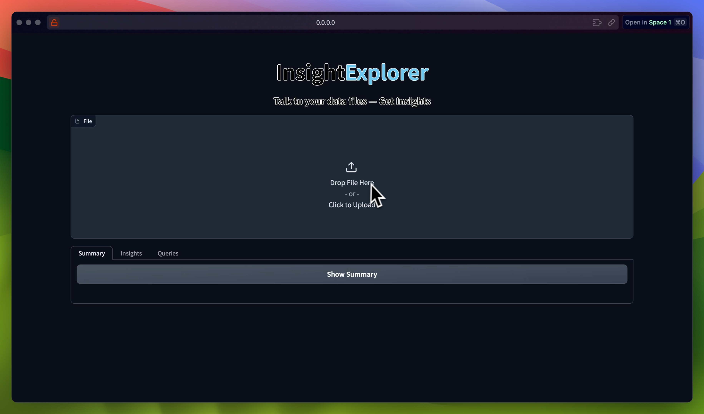
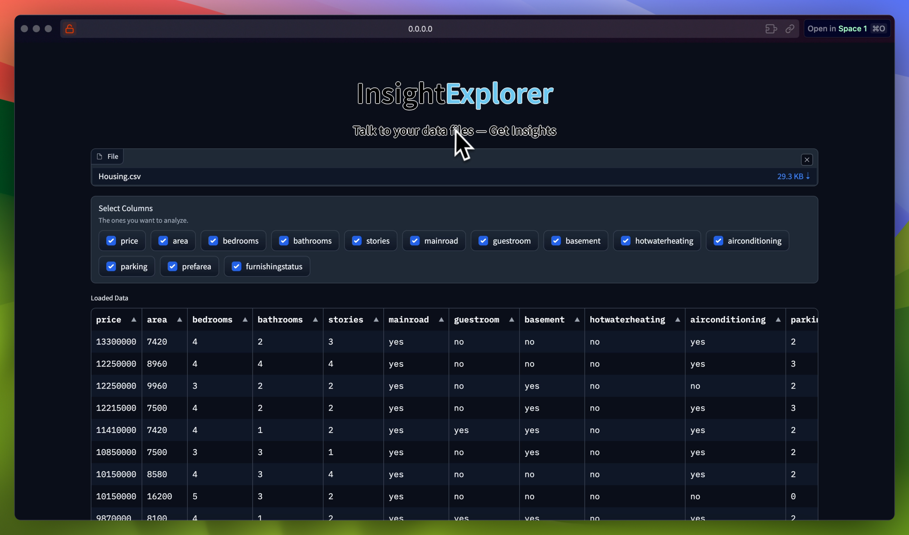

# Insight Explorer with LIDA & Gradio 🌟

Welcome to Insight Explorer, an innovative application that marries the power of [LIDA](https://github.com/microsoft/lida) with the simplicity and interactivity of Gradio. Insight Explorer is your gateway to creating compelling data visualizations and infographics, leveraging the best of AI and user-friendly interfaces.




LIDA, a versatile library for data visualization, becomes even more accessible through Gradio. Whether you're a data scientist, a developer, or a storyteller, Insight Explorer is designed to make your data speak in the most visually engaging way.

## Features 🚀

- **Interactive Visualizations**: Create and interact with data visualizations in real-time.
- **Large Language Model Integration**: Seamlessly integrates with various large language models like OpenAI, Azure OpenAI, PaLM, Cohere, and Huggingface.
- **Grammar Agnostic**: Works across different programming languages and visualization libraries (matplotlib, seaborn, altair, d3, etc.).
- **Secure API Key Management**: Learn to handle secrets like API keys with utmost security using .env files.
- **Pre-trained Models**: Utilize cutting-edge pre-trained models for advanced text generation and summarization.

## Dive In 🏊

Get hands-on with Insight Explorer:

1. Ensure Python 3.7+ and pip are installed on your system.
2. Clone the repository and switch to the project directory.
3. Install dependencies with `pip install -r requirements.txt`.
4. Securely set your API keys as environment variables.
5. Launch Insight Explorer by running `gradio run app.py`.

```bash
gradio run ui_lite.py
```

## Demonstration 🎥

Take a peek at Insight Explorer in action:


## Join the Community 🤝

Insight Explorer thrives on collaboration. Your contributions and suggestions are what make this project dynamic and relevant. Whether it's code, documentation, or creative input, your ideas are welcome here.

Let's embark on this journey of learning and discovery together. Happy Exploring!
